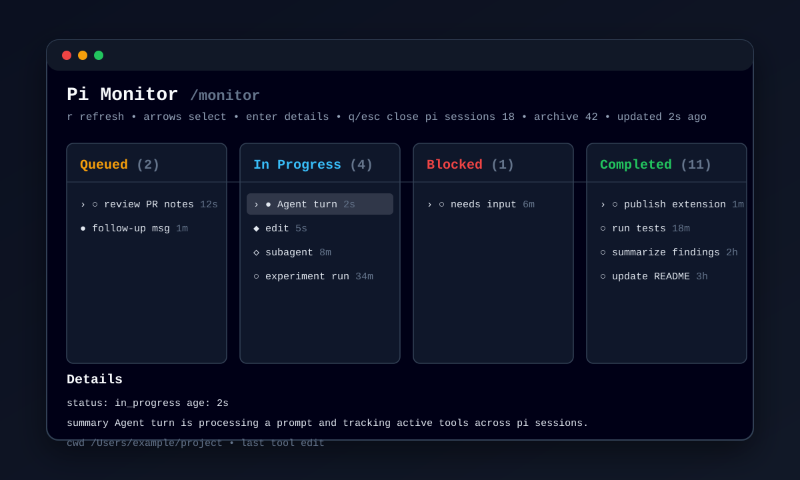

# pi-monitor

> **Experimental:** this pi extension is an early personal experiment. APIs, storage format, and UI behavior may change without notice.

`pi-monitor` adds a `/monitor` command to pi. It opens an interactive TUI board showing queued, in-progress, blocked, and completed pi work across recent sessions.



## Install

```bash
pi install git:github.com/PriyangaPKini/pi-monitor
```

Then restart pi or run `/reload`.

## Use

```text
/monitor
```

Controls:

- `r` refresh
- arrow keys select items
- `enter` toggle details
- `q` or `esc` close

## Notes

- Maintains a central live registry under `~/.pi/agent/monitor/` from pi lifecycle events emitted by each loaded extension process.
- Reads recent pi session files from `~/.pi/agent/sessions/` as a fallback for sessions that are not in the live registry.
- Hides bash items from the board.
- Shows **Blocked** only from live registry signals, such as a live Pi turn ending with text that asks for input or a provider error.
- Intended for interactive TUI mode.

## License

MIT
